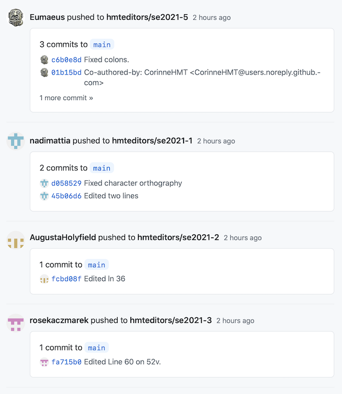

# Editing the *Iliad*

---

# Data formats

- indexing: tabular files
- editions: XML

---

# Tabular files

- relate objects identified by URN

---

# XML documents

- regular citation structure (book/line)
- potentially complex structure within citation unit

---

# XML **elements**

- have explicit begin/end
- may contain
    - text content
    - other elements
- may have associated data in *attributes*

---

# XML **attributes**

> `name="value"`

---

# Reading XML

     <l n="84">Ζεὺς ὅς τ' ἀνων ταμίης πολέμοιο τέτυκται: </l>

Techspeak:

> The `l` element with `@n` = `84` has text content "Ζεὺς ὅς τ' ἀνων ταμίης πολέμοιο τέτυκται:"

English:

> "The reading for line 84 is "Ζεὺς ὅς τ' ἀνων ταμίης πολέμοιο τέτυκται:"

---

# XML rule sets (schemas)

- Text Encoding Initiative (TEI)
- compliance checked automatically in VS Code

---

# HMT limitations on TEI

- what elements are allowed?
- what sequences/embeddings are allowed?

---

# 3 tiers of markup

1. transcription level
2. tokenization level
3. disambiguation level

---

# 1. Transcription

What do we read on the MS page?

- is the text legible? (`unclear`)
- has the scribe altered the text? (`del`, `add`)

---

# 2. Tokenization

How does the text group in parseable units (tokens)?

- mark numbers: `<num value ="1">α</num>`
- are there alternate readings?  (e.g., abbreviation expanded by HMT project editor)

---

# 3. Disambiguation

Identify named entity:

- person (`persName`)
- place (`placeName`)
- ethnic group (`<rs type="ethnic">`)

---

